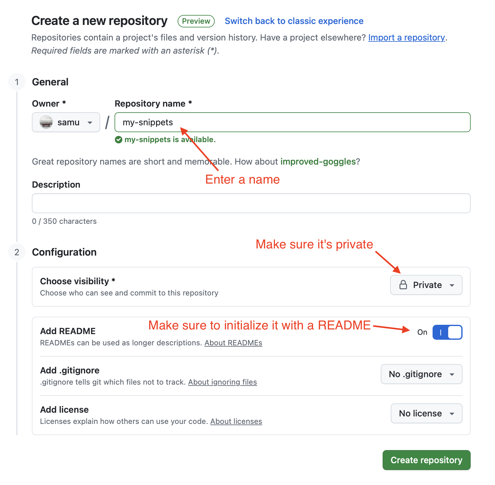
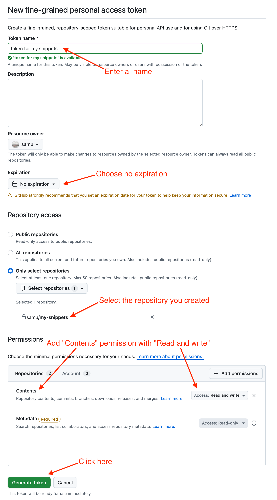
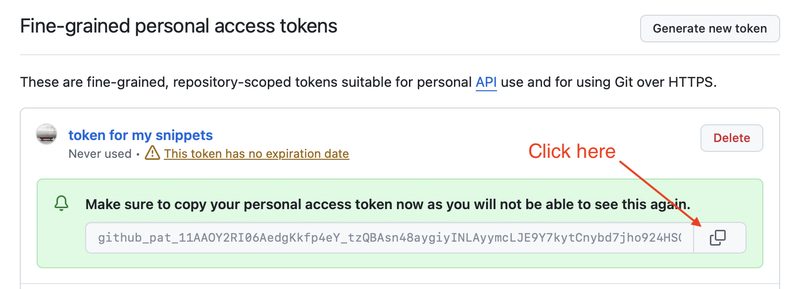
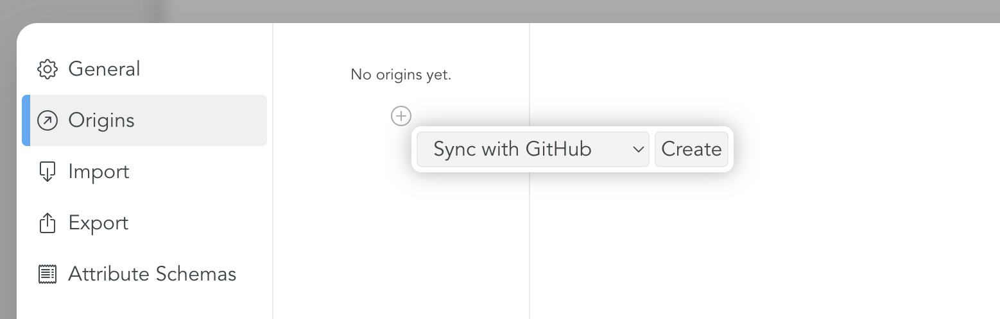
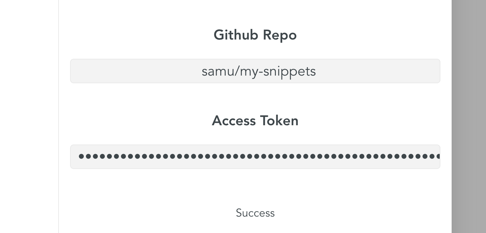
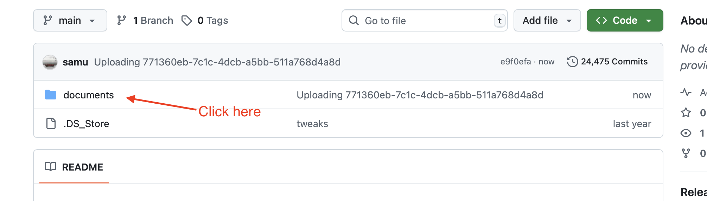
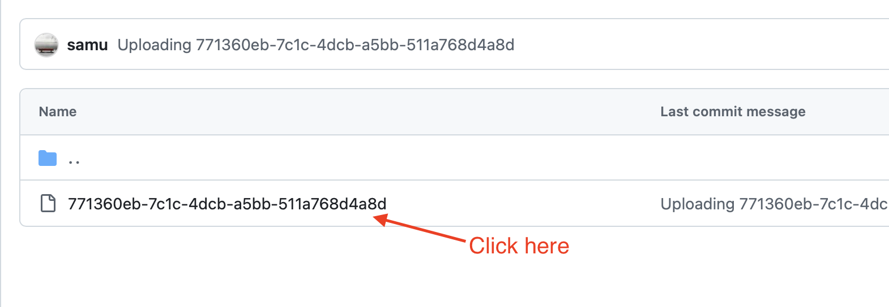
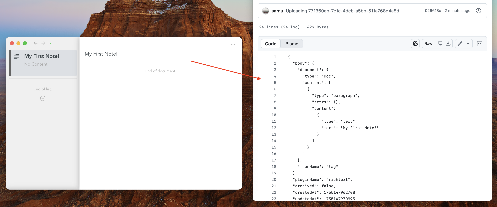

# Syncing with GitHub

## What is GitHub?

GitHub is an online platform generally used by software developers to host code. Snippets leverages this in a special way — instead of storing software code, it stores notes as JSON files along with any media you’ve attached. This gives you the following advantages: secure storage, full version history, and access from anywhere.

## What is a GitHub repository?

A GitHub repository is a backed-up project folder with built-in history, which is usually used by software engineers to host their source code. Snippets leverages this to store notes instead of code. Repositories can be made private - nobody will see your notes.

## How do i set it up?

Syncing with GitHub is possible with the following steps:

- Prepare a GitHub origin in Snippets App
- Create a GitHub account
- Create a GitHub repository
- Create a personal access token
- Copy the token
- Paste the token into the Snippets App

## 1. Create a GitHub repository on github.com

> 💡 Tip: <kbd>cmd</kbd>-<kbd>click</kbd> the following links to open them in a new tab

1. [Create a GitHub Account](https://github.com/signup) if you haven't already
2. Go to [new repo](https://github.com/new)
3. Choose a name, set the repo to private, and initialize it with a README

|  |
| ------------------------------------------------------ |

## 2. Create access token

> 💡 Tip: <kbd>cmd</kbd>-<kbd>click</kbd> the following link to open it in a new tab

1. Go to [new personal access token](https://github.com/settings/personal-access-tokens/new)
2. Set a name
3. Set expiration to "No expiration"
4. Choose "Only select repositories" and pick the repository you created before
5. Click "Add permissons", add "Contents" and set it to "Read and write"
6. Click "Generate Token"

|  |
| ------------------------------------------------- |

## 3. Copy the token

|  |
| ------------------------------------------------------ |

## 4. Create a GitHub origin in Snippets App

1. In the snippets app, go to settings (Via top menu Snippets -> Settings or with <kbd>CMD</kbd>+<kbd>,</kbd>)
2. Create a GitHub origin

|  |
| --------------------------------------------------------- |

## 5. Paste token and repo

1. Copy-paste the url of your repository
2. Copy-paste the token

|  |
| ------------------------------------------------ |

## And now?

Snippets will sync all of your notes with GitHub automatically. You can refresh the github repository in the browser to see the raw data:

|  |
| ---------------------------------------------------- |

|  |
| --------------------------------------------------- |

|  |
| -------------------------------------------- |

## What happens if i lose the token?

You can regenerate the token and copy-paste it to the Snippets settings page.
