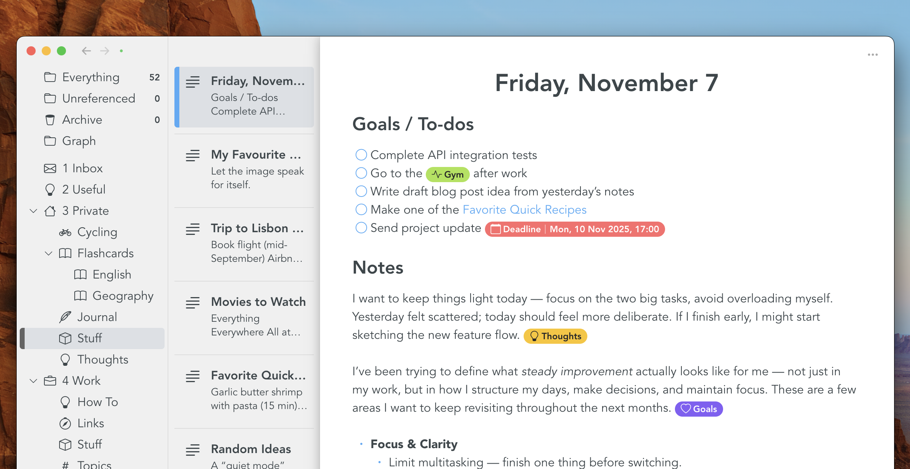
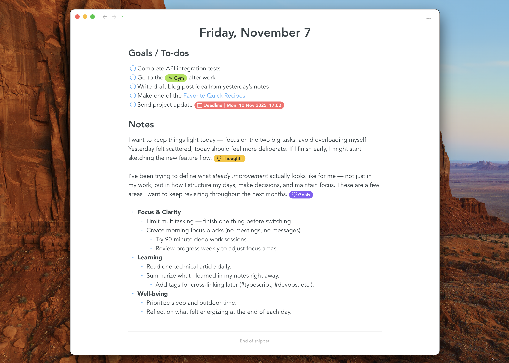
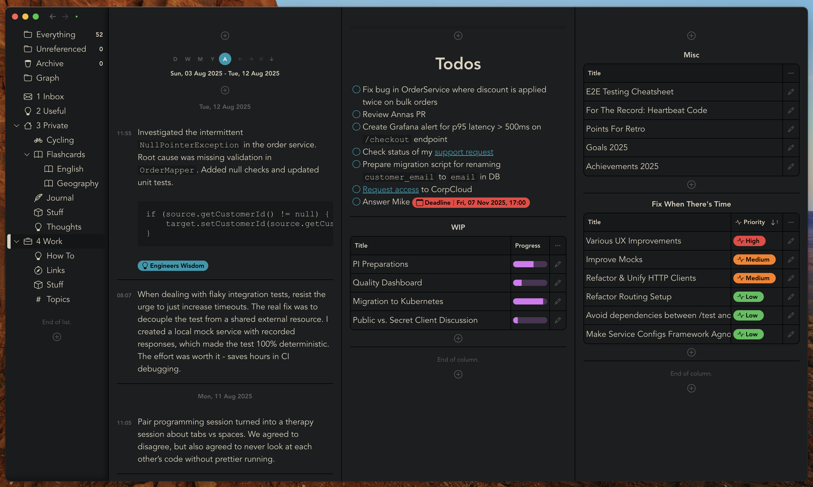
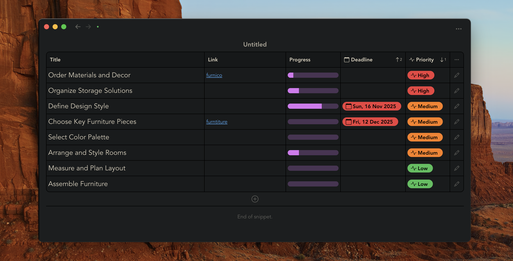
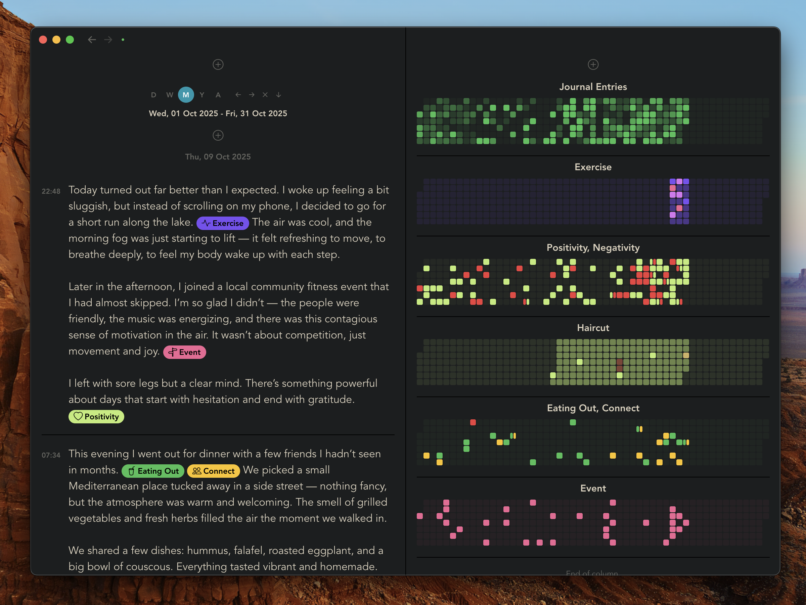
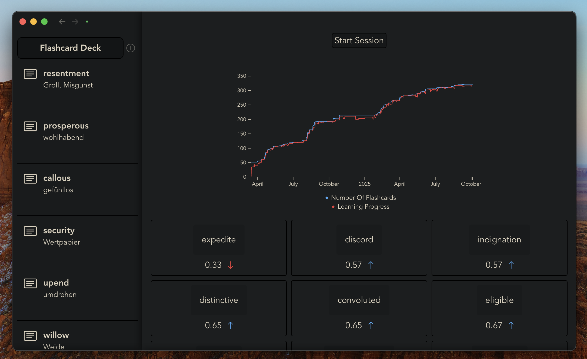
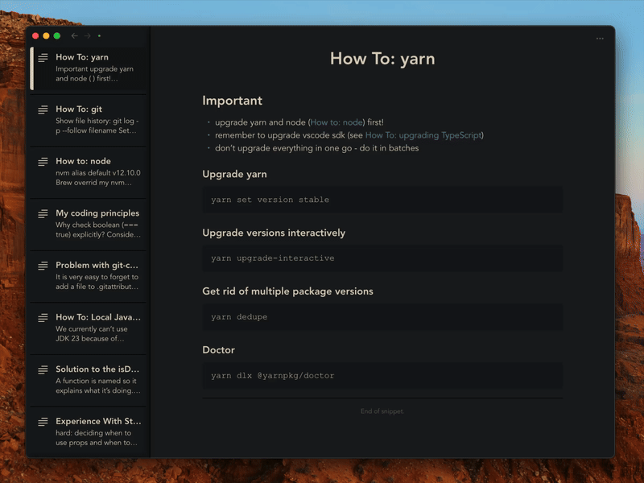

# Snippets App

## Download

### Mac

[Mac Intel](https://github.com/samu/snippets/releases/download/v0.16.0/Snippets-0.16.0-x64.dmg) | [Mac ARM](https://github.com/samu/snippets/releases/download/v0.16.0/Snippets-0.16.0-arm64.dmg)

### iOS

[iOS (Beta via TestFlight)](https://testflight.apple.com/join/3wpgBj2Z)

### Windows

[Windows](https://github.com/samu/snippets/releases/download/v0.16.0/Snippets-0.16.0.Setup.exe)

### Android

[Android (Beta via APK)](https://github.com/samu/snippets/releases/download/v0.16.0/Snippets-0.16.0.apk)

## Features

### Rich Text Editor

You might've had bad experiences with rich text editors before.

The common pitfalls are:

- it isn't straight forward to create new formattings, such as a headings or bold text.
- it is unclear in which formatting your cursor is: is it inside or outside that bold text?
- pasting content gives weird results.
- clicking a link opens the browser instead of allowing you to edit the link or label.
- etc.

Snippets solves these problems:

- it allows you to use markdown-like syntax to create formattings. For example, you can type `#` followed by <kbd>Space</kbd> to create a heading.
- it allows you to destroy formattings using backspace. For example, you can place your cursor at the beginning of a heading and press <kbd>Backspace</kbd> to delete the formatting.
- you can jump in and out of formattings with <kbd>ArrowLeft</kbd> and <kbd>ArrowRight</kbd>. For example, you can place your cursor in front of bold formatting, press <kbd>ArrowLeft</kbd> to enter the bold formatting, then continue writing in bold. Escape the formatting by pressing <kbd>ArrowRight</kbd>.
- it has a built-in toolbar allowing for more complex interaction.
- you can double-click at the end of a paragraph or list item in order to select the node. Then, you can drag-and-drop the selection to any other place within the document.

### Not Markdown Based

Snippets is intentionally _not_ based on Mardown. Markdown is a great fit in technical, collaborative scenarios where documentation is stored in version control systems. However, it is inherently unsuitable for the note taking use case. By not relying on markdown, Snippets is capable of using much more complex data structures rather than just plain text files.

It is no problem at all to

- use tags which have spaces ("Some Tag" as opposed to "some-tag")
- use deeply nested bullet points which include code blocks and quotes
- use inline katex formulas (as opposed to block scoped ones)
- use complex objects such as embedded reminders (this is an upcoming feature)
- edit text without the chaotic and jumpy behaviour of modern markdown editors which have to hide control syntax

Snippets gives you a beautiful what-you-see-is-what-you-get (WYSIWYG) editing experience with great formatting capabilities without sacrificing usability. A simple export-to-markdown feature ensures that there is no vendor lock-in.

### Offline first & sync with anything

You can use the app offline and without an account. All your data is cached on your local disk. You can choose how you want to back up your data:

- **Local Folder**: everything is stored in a folder which you choose. This allows you to, for example, back up your data in google drive. Please note that it is _not_ possible to sync with mobile devices this way.
- **GitHub**: you can choose to store everything in a GitHub repo. There is no need for manual or periodic commits: once you've changed a doc, the app immediately initiates a sync and uploads to GitHub. This can be used on mobile devices too, because the app uses the HTTP api to sync with GitHub. Please follow [this guide](GITHUB.md) to learn how to set this up.
- **Self Hosted**: (Note: not yet released) data sync is based on a simple protocol (fetch all, push, upload media) which makes it easy to self-host a server with which you can sync. This option will become available in the future.
- **Snippets Cloud**: (Note: not yet released) this will be the apps official storage solution. It will allow for use cases such as note sharing and AI integration.

### 5 core concepts

Snippets is made up of 5 core concepts. They exist in isolation and accumulate to great power once combined:

- **Snippets**: Anything you create in Snippets is called a "Snippet". A rich text note is a Snippet. Folders, Dashboards, Flashcards - they're all Snippets. Snippets is built on a flexible architecture: anything that can be described as a JSON document and represented with a UI can exist within the app. This concept allows the app to support a multitude of productivity use cases: personal knowledge management, writing, journaling, task management, habit tracking, studying, etc.
- **References**: Individual snippets can reference each other. Rich text notes can reference other rich text notes. Folders or Flashcard Decks can reference Rich Text Notes or Flashcards. This allows for different ways of organization. You can organize hierarchially, as it is commonly done with folders, or you can use the "wiki-links" style by making links between notes.
- **Attributes**: Attributes are small units of information you can attach to snippets. For example, they can be used like tags inside notes, or like Properties outside of a document. Think of them as a cross-over between classic tags and structured data fields. They have a data type (list of strings, number, date, etc.) and can be given a color and an icon.
- **Filters**: (Note: not yet released) Filters implicitly reference other snippets based on how they are configured. They become powerful once you have a large base of data that you'd like to narrow down by specific queries.
- **Origins**: Origins allow you to define how your data is synced. Currently supported are file origins and GitHub origins, meaning, you can store your data either locally on disk or in a GitHub repo. In the future, there will be options to self-host as well as using an all-in-one cloud solution.

### A clean UI and easy navigation

The core UX design principle in Snippets is minimalism. The app is not overloaded with unnecessary sidebars, buttons and menus. You navigate with a dead simple sidebar that shows all of your folders. A set of beautiful icons brings personality and refinement to the experience.

### Attributes and attribute schemas

Attributes are like tags on steroids. You can define schemas for them, specifying which shape they can take. You can specifiy a color, an icon and a data type. You can then start using attributes inside rich text documents or as table columns. Once you've created a schema, type "/" inside a note to bring up an autocomplete from which you can create an attribute.

### Dashboards

A unique feature of Snippets is dashboards. You can place notes and tables alongside each other to make all of your relevant notes accessible in an instant. Working with Snippets is like having a real desk on your screen — you lay out your content visually and navigate it effortlessly through natural spatial recognition.

### Tables

Tables allow you to organize multiple snippets in one place. You can define columns you'd like to use, which can be based on attributes you've created before.

### Visualizations, Journaling and Habit Tracking

The visualization plugin allows to visualize filtered data. For example, you can track the occurence of attributes within notes. Combined with the built in journal plugin and dashboards, you can build your own habit tracker.

### Flashcards

Flashcards is yet another type of Snippet. The same way you create folders, you can create Flash Cards Decks, within which you can store Flashcard Snippets. Each card has two sides, which can be edited with the same rich text editor that is used for plain notes. You can then practice your cards. An algorithm makes sure to show the most important cards first.

### CMD+K

This built in feature is made especially for software engineers who want to quickly access often used CLI commands.

### Rich Text Editing Demo

- Use <kbd>Space</kbd> to create formattings and <kbd>Backspace</kbd> to destroy them
- Use <kbd>ArrowLeft</kbd> and <kbd>ArrowRight</kbd> to enter formatting boundaries
- Use <kbd>Enter</kbd> and <kbd>Escape</kbd> when inside a link mark to toggle focus between the link input and the editor

## How can i sync with a GitHub repository?

Please follow [this guide](GITHUB.md).

## Where should i follow / how can i get in touch?

Follow for app updates here:

- [snippets@bluesky](https://bsky.app/profile/snippets.ch)
- [snippets@x](https://x.com/snippetsHQ)

Chat here:

- [Discord](https://discord.gg/CWuenNJcpy)

Follow the creator here:

- [samu@bluesky](https://bsky.app/profile/samu.codes)
- [samu@x](https://x.com/samucodes)
- [samu@reddit](https://www.reddit.com/user/samu-codes/)

## Where is the source code?

Snippets is not open source. There are no concrete plans (yet) for open sourcing.
