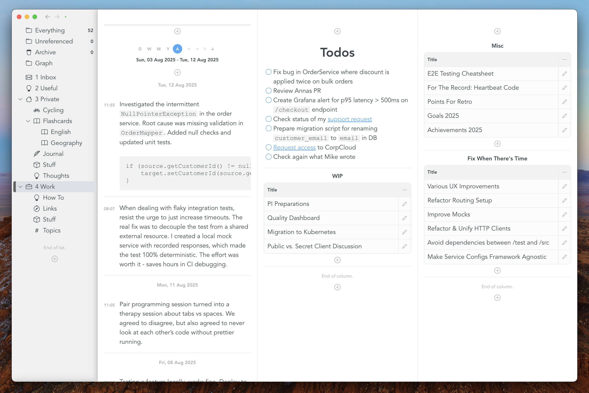

# Snippets App

## What is this?

This repository hosts the releases and documentation of Snippets.

## Where can i download the macOS Client?

- [Mac (Apple Silicon)](https://github.com/samu/snippets/releases/download/v0.11.0/Snippets-0.11.0-arm64.dmg)
- [Mac (Intel)](https://github.com/samu/snippets/releases/download/v0.11.0/Snippets-0.11.0-x64.dmg)

## Where do i find the iOS app?

The iOS app is in beta. It is testable via TestFlight, which is an official app from Apple to facilitate beta-testing. Use [this link](https://testflight.apple.com/join/3wpgBj2Z) to get access.

## Is it available on Windows / Linux / Android?

Not yet, but it is implemented with cross-platform in mind, so it will for sure be available on other platforms in the future.

## How can i sync with a GitHub repository?

Please follow [this guide](GITHUB.md).

## Where should i follow / how can i get in touch?

Follow for app updates here:

- [snippets@bluesky](https://bsky.app/profile/snippets.ch)
- [snippets@x](https://x.com/snippetsHQ)

Chat here:

- [Discord](https://discord.gg/CWuenNJcpy)

Follow the creator here:

- [samu@bluesky](https://bsky.app/profile/samu.codes)
- [samu@x](https://x.com/samucodes)
- [samu@reddit](https://www.reddit.com/user/samu-codes/)

## Where is the source code?

Snippets is not open source. There are no concrete plans (yet) for open sourcing.

## Features

### Dashboards

### Flashcards

### Journaling and Habit Tracking

